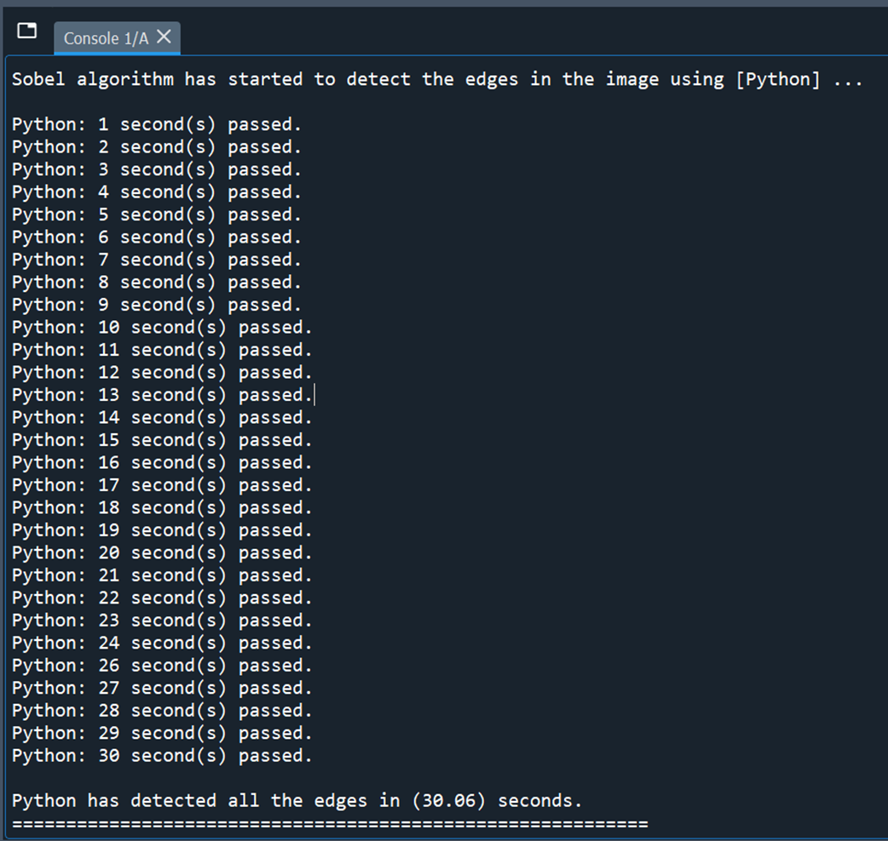
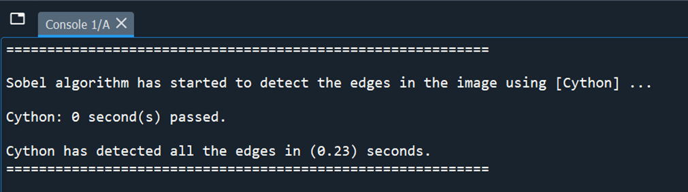

## Comparison of Python and Cython Performance in Sobel-based Edge Detection Tasks

This repository contains Python and Cython implementations of the Sobel edge detection algorithm for image processing. The codes and files provided are:
1.	sobel_pycode.py: Python implementation of the Sobel edge detection algorithm using NumPy.
2.	sobel_cycode.pyx: Cython implementation of the Sobel edge detection algorithm with C optimizations.
3.	setup.py: Python script to compile the Cython code into C Extension Module.
4.	test.py: Python script to execute and compare the Python and Cython implementations.
5.	img4.png: Sample image for testing the edge detection algorithm.
   
   
## Environment and Installation of Dependencies
To set up the environment and install necessary dependencies:
1. Create a new Anaconda environment:

	conda create -n image_processing_env python=3.
 
2. Activate the environment:

	conda activate image_processing_env 

3. Install required packages:

	conda install numpy matplotlib imageio cython 

4. Compilation
Compile the Cython code (sobel_cycode.pyx) into C Extension Module (run the Anaconda Prompt in the same directory):

	python setup.py build_ext --inplace 

5. Generate HTML annotations for the Cython code

	cython -a sobel_cycode.pyx

6. Execution
Execute the main Python script (test.py) to compare the execution times of the Python and Cython implementations:

	python test.py 

## Results
Results
The execution times of the Python and Cython implementations of the Sobel edge detection algorithm will be displayed, along with visualizations of the original and processed images. See the ouput sample below:

